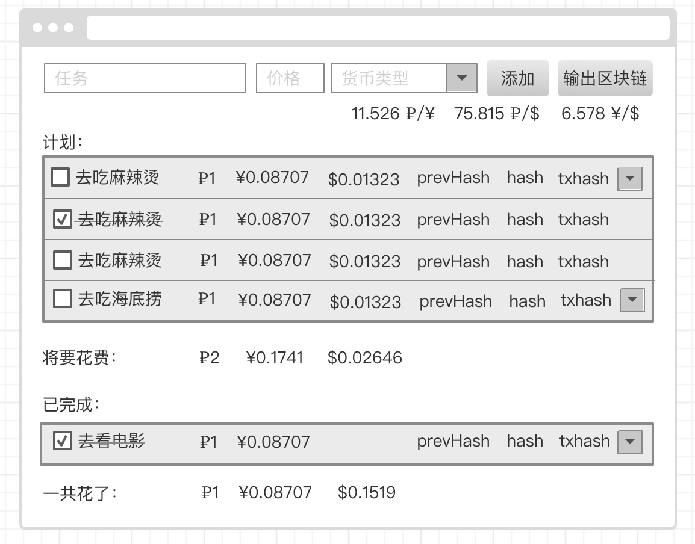

# 面试任务

## 要求

使用 react

不可以使用class组件，只能使用函数组件

使用 hooks 方式

完成后，给我们发送可以看的链接，例如 github，gitee。可以告诉我们需要多少时间。

## UI


## 接口
> 接口：https://api.globus.furniture/forex <br>
> 功能：获取汇率 <br>
> 请求方式：GET

接口返回示例：
```json
{
    "USD": {
        "value": 0.1520248078866076, // 人民币 => USD
        "previous": 0.15222544878563884,
        "date": "2020-11-25T11:30:00+03:00"
    },
    "RUB": {
        "value": 11.5257, // 人民币 => RUB
        "previous": 11.5326,
        "date": "2020-11-25T11:30:00+03:00"
    }
}
```

## 任务描述

### 第一部分

有四个控件，分别是：
1. 任务编辑框
2. 价格编辑框
3. 货币选择框
4. 添加按钮

前面三个控件为必填项。

货币类型分别有三种：
1. 卢布
2. 人民币
3. 美元

### 第二部分

显示货币之间的汇率，这个汇率需要使用上面提供的接口

### 第三部分

添加按钮被点击后，会添加到计划列表里面。

计划列表项会显示：
1. 未被选中的 checkbox
2. 任务名
3. 卢布
4. 人民币
5. 美元

假如添加的时候，价格写1，货币类型选择了卢布，点击添加后，计划列表项中，卢布会显示1，人民币会显示0.08707（卢布 => 人民币），美元会显示0.01323（卢布 => 美元），这个换算需要使用上面提供的接口。

然后最下面那行会显示将要花费多少钱，是所有计划的总支出。

### 第四部分

当计划项被完成后，计划项会被移动到已完成列表。

已完成列表项显示的内容跟计划列表相似，checkbox 会变成勾选状态，任务名会被划掉。

然后最下面那行会显示一共花了多少钱，是所有已完成计划的总支出。


# 面试任务-进阶

## UI



## 任务描述

继上一个面试任务，做一个区块链，用来保存 todolist 的数据。

## 任务要求

1. 只需要实现区块链的基本结构，不需要做共识机制之类的
2. 区块链的数据结构不需要全按照标准来，可以自行增删修改标准中的数据结构，但需要能体现出区块的本质
3. 只需要实现一条链，这条链是保存在 js 变量中的，然后维护它
4. 设定每半分钟生成一个区块，一个区块最大可以存5条数据
5. 区块链的数据只能增加和查看，不能删除和修改

## 任务功能

1. 实现上一个任务 todolist 的所有功能，todolist 的数据使用区块链保存
2. 添加一个“输出区块链”按钮，点击后，可以在 console 中看到区块链的状态(直接将保存区块链的变量，console.log 出来即可)
3. 生成一个区块的时候，console 中输出一下这个区块
4. 每个 todo 项，添加以下内容
    - 添加 prevHash 标签，显示当前 todo 项所在区块的上一个区块的 hash
    - 添加 hash 标签，显示当前 todo 项所在区块的 hash
    - 添加 txhash 标签，显示当前 todo 项所在交易的 hash
    - 添加交易历史记录按钮，点击后，会下拉列表显示关于这个 todo 项的所有交易记录，例如 ui 图，点击了第一个 todo 项后，列出了2个以前的交易记录
