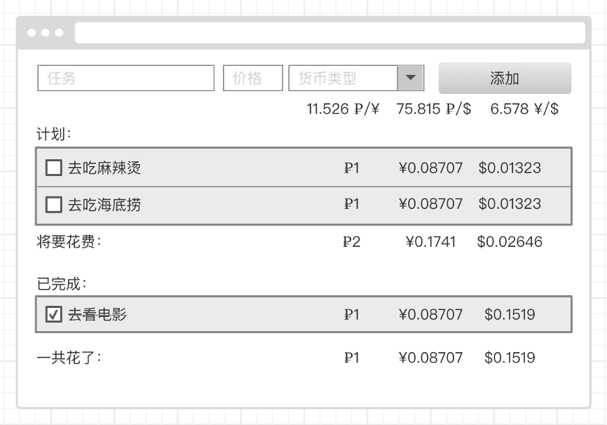

# 面试任务

## 注意不要犯以下错误

**（我们通过这个任务看您的代码质量和风格等等，来进行了解您的水平，所以您要尽可能的做好点）**

* 定义状态要合理，不要出现定义了多余状态的情况
* 合理划分组件
* 不能修改到状态的值


## 要求

使用 react

不可以使用class组件，只能使用函数组件

使用 hooks 方式

完成后，给我们发送可以看的链接，例如 github，gitee。可以告诉我们需要多少时间。

## UI


(样式不必与此图一模一样，内容相同即可)

## 接口
> 接口：https://api.exchangerate.host/latest?base=USD&symbols=CNY,RUB <br>
> 功能：获取汇率 <br>
> 请求方式：GET

要是接口访问不到那就用这个函数模仿情况
````ts
const fetchForexRates = () => {
    return new Promise((resolve) => {
        setTimeout(() => {
            resolve({
                success: true,
                base: "USD",
                date: "2022-08-16",
                rates: {
                    CNY: 6.781836,
                    RUB: 61.263275,
                },
            });
        }, 200);
    })
};
````

## 任务描述

### 第一部分

有四个控件，分别是：
1. 任务编辑框
2. 价格编辑框
3. 货币选择框
4. 添加按钮

前面三个控件为必填项。

货币类型分别有三种：
1. 卢布
2. 人民币
3. 美元

### 第二部分

显示货币之间的汇率，这个汇率需要使用上面提供的接口

### 第三部分

添加按钮被点击后，会添加到计划列表里面。

计划列表项会显示：
1. 未被选中的 checkbox
2. 任务名
3. 卢布
4. 人民币
5. 美元

假如添加的时候，价格写1，货币类型选择了卢布，点击添加后，计划列表项中，卢布会显示1，人民币会显示0.08707（卢布 => 人民币），美元会显示0.01323（卢布 => 美元），这个换算需要使用上面提供的接口。

然后最下面那行会显示将要花费多少钱，是所有计划的总支出。

### 第四部分

当计划项被完成后（被点击后），计划项会被移动到已完成列表。

当已完成列表被点击后，会被移动到计划列表。

已完成列表项显示的内容跟计划列表相似，checkbox 会变成勾选状态，任务名会被划掉。

然后最下面那行会显示一共花了多少钱，是所有已完成计划的总支出。
